# YogaRoster – Demo & Main Flows

YogaRoster is a weekly lesson-booking app for a solo yoga teacher and her students. There
are two people who use it: the **teacher**, who plans the week and manages her roster, and
the **student**, who books herself into lessons from a link the teacher shares. This document
walks through each of their main flows, with real screenshots from the app.

Screenshots live in [`screenshots/`](screenshots/) alongside this file.

---

## Teacher flow

### 1. Sign in

The teacher logs in with her email and password. If she forgets her password, "שכחתי
סיסמה" (forgot password) starts a recovery flow: she enters her email and phone, and if they
match her account **and** her WhatsApp is connected, a 4-digit code is sent to her over
WhatsApp — entering it logs her straight in, no separate reset step.

| Login | Forgot password |
|---|---|
| 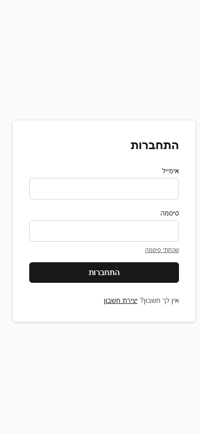 | 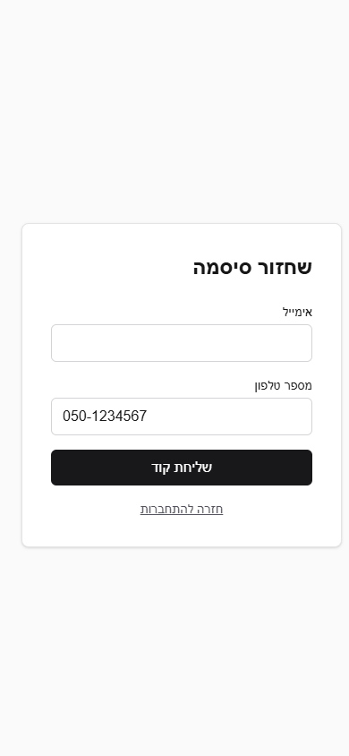 |

### 2. Dashboard

After logging in, she lands on her dashboard: her name, her WhatsApp connection status, and
two shortcuts — **שיעורים** (lessons) and **תלמידים** (students).

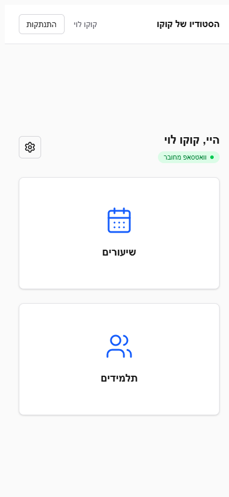

### 3. Plan the week

The lessons screen shows the current week's schedule. From here she can:
- Step forward/back between weeks
- **העתק משבוע קודם** — copy last week's lessons into this week (asks for confirmation first)
- **פרסם לקהילה** — publish this week and copy a shareable link for students
- Tap **+ הוספת שיעור** to create a new lesson (day, time, duration, capacity, optional comment)

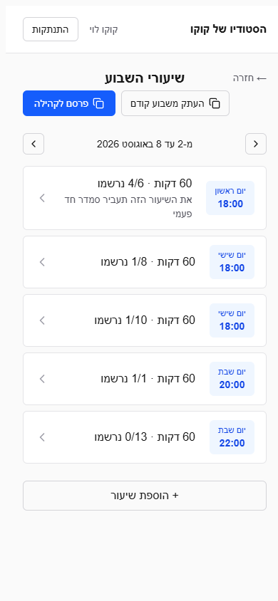

### 4. Manage a lesson's roster

Tapping a lesson opens its roster: who's registered, who's waitlisted, each student's phone
number, and her **credit balance** (the same badge style as the students list — turns red at
zero or below, so a teacher can spot at a glance who needs to buy more before the lesson).
From here she can manually register a student, cancel a registration, or send a WhatsApp
reminder to everyone registered.

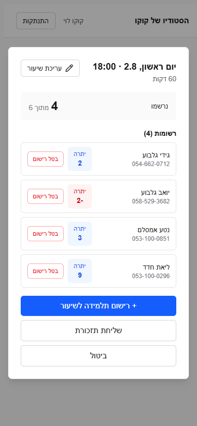

Tapping **עריכת שיעור** switches to the edit form for that lesson's day, time, duration,
capacity, and comment.

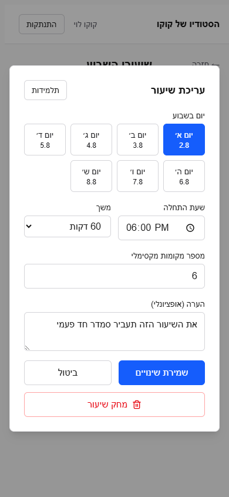

### 5. Manage students

The students screen lists everyone registered with the teacher, each with their own credit
badge. From here she can add a new student, edit an existing one's details or credit balance,
or link one student to another (e.g. a parent who registers on behalf of her child).

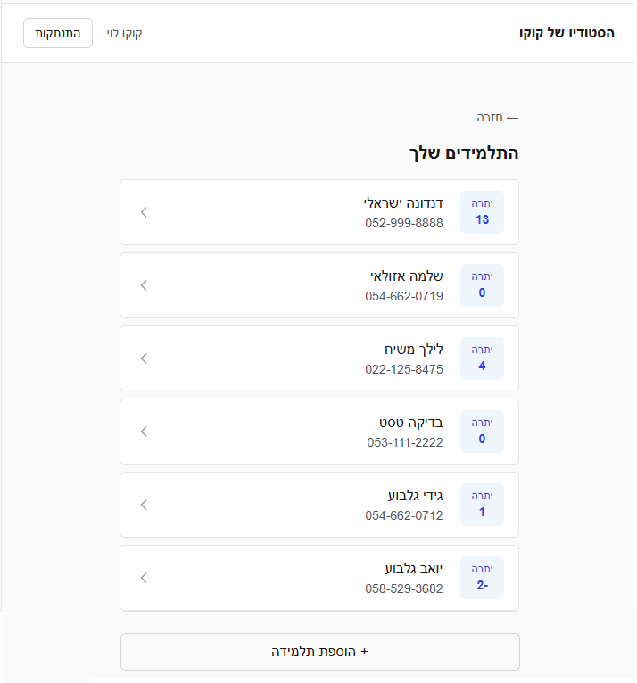

### 6. Settings

App name, background image, default lesson capacity/duration, her own phone number, and
connecting WhatsApp (via QR code) all live here — this is also where the WhatsApp connection
that powers reminders and password-recovery codes gets linked.

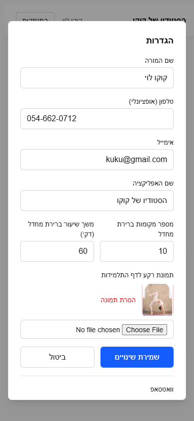

### Admin (separate role, not shown to teachers)

A site administrator can see every teacher's account, edit her details, set a new password,
disable/re-enable her account, or open her app directly to help troubleshoot — without needing
her password.

---

## Student flow

### 1. Open the shared link

A student reaches the app via a link her teacher published (typically shared over WhatsApp).
The first time, she identifies herself with her full name and phone number — after that, a
cookie remembers her, so she skips straight to the lesson list on return visits.

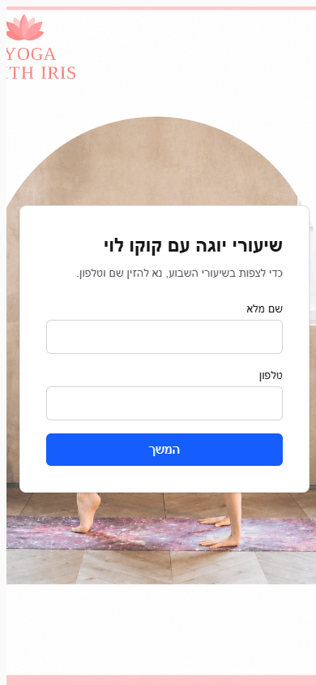

### 2. Browse and book the week's lessons

She sees the week's lessons — day, date, time, and status (open spots, full, waitlist, or
already registered), plus any note the teacher left on a lesson. She checks the lessons she
wants and taps **עדכון הרשמה** to update her registrations in one go. If she's linked to a
dependent (e.g. her child), a toggle at the top lets her switch who she's registering for.

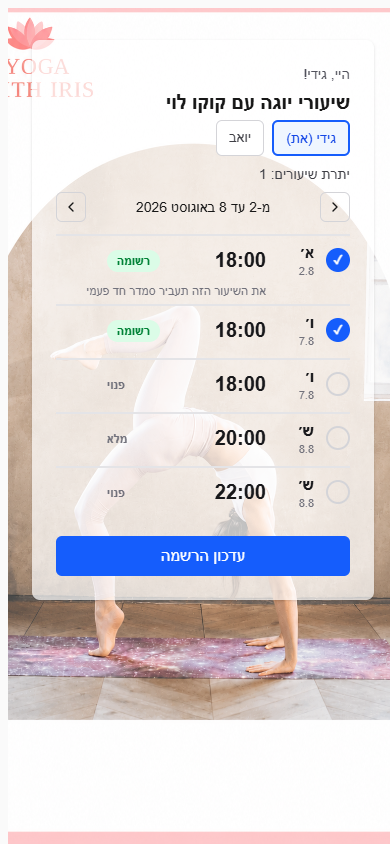

### 3. Confirmation

After submitting, she sees a per-lesson result — registered, waitlisted (if the lesson filled
up), or cancelled — along with her remaining credit balance.

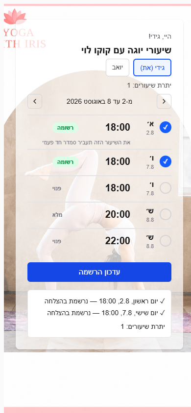

---

## How these screenshots were made

Captured live from the app's local dev server (`localhost:3000`) using the real UI and real
(demo) data — no mockups. Credentials and data shown belong to a local development database
only.
